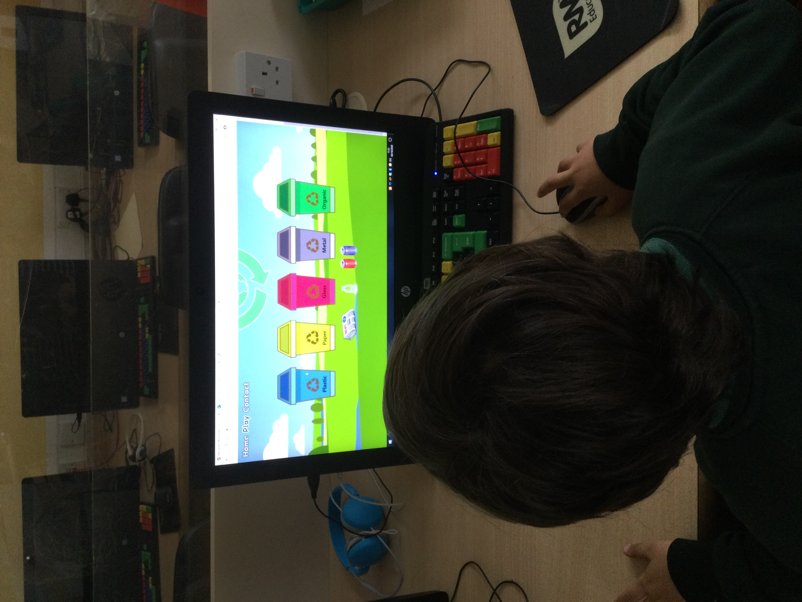

# Second Milestone Project - RecycleIt!

For my second Milestone project I decided that I wanted to make an educational game. I had the idea of combining
two criteria's together, one being my educational background in Geography and the environment which I studied
at University. The second being the opportunity of utilising my partners position as a Primary School Teacher,
to test and get user experience from her students playing my game. I am passionate about the environment and I
believe the importance of recycling is paramount. For households in the UK, recycling now is quite common practice 
and the majority adhere to it. However, I believe it is important for younger generations to learn about recycling
from an early age, to encourage them that recycling is essential for helping protect the world we live in. So the aim
of this website is to teach children the very core basics of recycling, via a fun and interactive game. As the game
is aimed at an audience of children aged 4/5 years upwards, I have kept it very simple. I thought using a drag and drop
feature for the game would provide the most amount of enjoyment as they can fully interact with it, and is also a good
way to help improve childrens mouse control skills. 

When planning the design of the website I seeked advice from my partner, asking questions like, What do the children
find fun and interesting visually when playing games on the computer? Any particular colours, sounds, movements? The 
general feedback was bright and bold colours, simple design, more illustration as opposed to real life photos/images,
and of course fun and silly sounds go a long way! This put me in good stead when designing the website and I had a clear
picture in mind of how I wanted it to look.  

## UX

The design of this website was built in mind for the user which would be young children aged 4/5 upwards. It had to be
straight forward to use and easy to navigate around, as in the user practically has to follow the direction i've created.
I started with finding a bright and colourful, illustrative rural background that would span the whole webpage, this would 
be the case on each page throughout the site. I wanted the header and footer to be non existent, I did not see the need of 
either as the sites purpose is a children's game, I wasn't looking to promote social media sites as I felt this would be 
inappropriate considering the users age, but also to keep the site looking simple. The only function needed was a navigational 
bar in the header, but even this I made without a background so the site background could be seen behind the navigation options.
Introduced next was the centered 'RecycleIt' logo which I created myself, this features across all pages in the same position. 
With these features implemented, this provided me with the framework for each of the sites pages, so all that was needed was to
add to each page accordingly.

## User Stories

### Child:
As a child, I want to play a fun game that has bright colours and lot's of images. It needs to be easy to understand
and not be too complicated.

### Teacher:
As a Teacher, I want an educational game for my students to play. One that they will enjoy but also learn from.
There should be a purpose and objective, that leads to the child understanding what they've achieved in the game.

### Parent:
As a parent, I want a game that my child can play which is different to conventional games they may play. I want
them to be able to learn something but also have fun whilst doing so.

## Features

### Home

The Home page has just one purpose, that is to explain what the site is, explaining that it is an educational game about 
recycling. All passages of writing throughout the site I designed to look as though it was illustrative, perhaps comic book
like. To do this I chose a font that I believed to be fun and bubbly that children might like (Fredoka One), I tried to
emulate a theme of speech bubbles for the text, as in text on a white background with thick black border with rounded off
corners. I've continued this design with the navigation links, but as mentioned previously I didn't want a background for them,
so I used the webkit-text-stroke to give the font a border. The page has two buttons in the 'About' section, one of them is
'How to Play' and the other is 'Play'. The 'Play' button simply takes the user to Level One of the game. The 'How to Play button' 
once clicked pops up a modal and explains to the user how to play the game. This is very specific to provide the user with all 
the information they need on how to play the game, specifically how the drag and drop function works to eliminate any confusion.
The 'How to Play' modal also has two buttons, 'Close' to close the modal and 'Let's play!' which again takes the user to Level
One of the game. 

### Play

### - Level-One

The 'Play' navigation link firstly directs the user to level-one.html which is the first level of the game. Level one consists
of 3 recycling bins and 3 items that need recycling. The aim of the game is to drag and drop the recyclable material to the
correct recycling bin. This is achieved by clicking on and dragging the recyclable material and then dropping it. If the item
dragged is dropped in the correct location, the item will disappear, if it is dropped in the wrong location, the dragged item
will revert back to it's original position. Once all 3 items have been successfully dropped in the correct locations, a pop up
modal will appear automatically to tell the user 'Congratulations', with 2 buttons, one to progress to Level Two and the other
for the user to return to the 'Home' page if they so wish. The images used for the game have been chosen purposely to fit in with
the design of the game. Again, appealing to the user by being illustrative instead of real life photos/pictures.

### - Level-Two

Level two of the game is simply an additional recycling bin for different materials, so now there will be 4 different materials
to be recycled. Usability remains the same as level one, including pop up modal when the level is complete for the user to
progress to Level Three.

### - Level-Three

Level Three is the last level of the game. The pattern continues, one additional recycling bin so there are now 5 different
matterials to be recycled. When the final item to be correctly dropped occurs, the automatic pop up modal will display a different
message this time. This will congratulate the user for completing the game. There are still two buttons, one of which is still the
button to return 'Home' , the other button instead of being for the next level, is now a link back to Level One for if the user 
wishes to play again. The game may appear to be short and easy to play, but this is all relevant to the user in mind. This is not
a game to try and trick and catch the user out, it is to inform and learn.

### Contact

The last page of the site is the 'Contact' page. I wanted to include a contact page so that I could receive feedback on the website.
Even though the target audience of the users are children aged 4/5 upwards, to access the site and to get started on the game, they
would still require adult supervision and assistance. This is why I wanted to include a contact page, mostly for the adult present 
whether they were the Teacher, parent, other family member, etc. They could then provide feedback for the game, suggestions on how
to improve it going forward, what they thought was good, but most importantly if the child enjoyed the game and learnt from it.
They can provide this feedback by filling in the form and submitting it, the information provided is then sent to my email address.

## Technologies Used

* HTML 5: Used to create the website
* CSS 3: Used to style the wesite
* JavaSript: For drag and drop functions, modals and email submission contact form
* [Bootstrap v4.5.2](https://getbootstrap.com/): Used for CSS shortcuts, Navbar, Form, etc.
* [Google Fonts](https://fonts.google.com/): Used to change from default Fonts
* [JQuery](https://code.jquery.com/jquery-3.5.1.js)
* Windows Photo Editor: Used to change size of images to suit website

## Testing

To test the functionality and how my website looked on varying scren sizes/devices I used Chrome Developer tools
throughout the project. There were plenty of challenges along the way with how making sure my website was acceptable
and fit for purpose on different screen sizes. Starting at the top, my navbar worked horizontally up until around tablet
device screen sizes, so I decided to collapse it to a hamburger style navbar using bootstrap. However, I didn't like 
the point in which it converted to hamburger style so I adjusted this using media queries. Luckily with this project
as it is a simple design and layout, there is not too much going on that needs drastically changing for different screen
sizes. There is nothing that has been hidden from larger screen sizes to small, every feature and function is visible
and usable throughout all screen sizes. In regards to the game itself, I had a clear vision of wanting all the recycling
bins side by side, even up to the max of 5 bins on the last level. This looks great on larger screens but possibly is a
bit cramped on smaller screens. I did test having the bins span across two rows, for example, 3 bins on one row then 2
on the next on smaller screen sizes. However, in my opinion I don't think it worked well and didn't look good vicaully.
From reviewing the game on the smallest screen size I think it works fine. All other aspects of the site just needed
tweaking, I made use of media queries to achieve this, and set breakpoints for common varying device screen sizes.

As mentioned at the beginning of this document, I was always going to test this game on it's target audience, using
students from a Reception class in a Primary School. I was fortunate enough to get feedback on the game from 2 students,
a girl aged 5 and a boy aged 4. The teacher started on the 'Home' page of the website, they read the 'How to play'
section and explained to each of them what they had to do in the game, what the aim was and how to achieve it. Both
children were very capable with knowing what to do with the dragging and dropping, and the difficulty was at an appropriate
level as both successfully completed the game. The girl, was able to read what the recycling bins were, whereas the boy
needed help with reading what the recyclig bin was for. Below are images of the 2 children playing the game and quotes
from both of them with their feedback of the game.

"I like this game. The food noise is my favourite."

"The food noise is funny. Can we play it again?" 

There are not too many areas of the website where the user has to interact with the page to achieve something, but where
there is a user interaction I have tested it by using the following steps:

* Logo Image is a link that will take the user back to the home page.
  1. Go to 'Play' page, click on logo image, takes user back to 'Home'
  2. Go to level-two.html, click on logo image, takes user back to 'Home'
  3. Go to level-three.html, click on logo image, takes user back to 'Home'
  4. Go to 'Contact' page, click on logo image, takes you back to 'Home'

* Check buttons on home page direct to correct page.
  1. Go to 'Home' page, scroll down to the 'How to Play' button, click on button and modal appears.
        - Whilst in 'How to Play'modal, click 'Let's Play!' button, takes user to level-one.html
        - Whilst in 'How to Play'modal, click 'Close' button, closes modal.
  2. Go to 'Home' page, scroll down to the 'Let's Play!' button, click on button and takes to 'Play' page.

* Check items on level-one.html can be dragged, check they can only be dropped in correct bins.
  1. Dragged plastic item to all other bins other than plastic bin, item reverts back each time.
  2. Dragged plastic item to plastic bin, disappears.
  3. Dragged paper item to all other bins other than paper bin, item reverts back each time.
  4. Dragged paper item to paper bin, disappears.
  5. Dragged glass item to all other bins other than glass bin, item reverts back each time.
  6. Dragged glass item to glass bin, disappears.

* When level-one.html level has been completed, check modal buttons
  1. Click 'Home' button, returns user to 'Home' page.
  2. Click 'Next Level' button, takes user to level-two.html

* Check items on level-two.html can be dragged, check they can only be dropped in correct bins.
  1. Dragged plastic item to all other bins other than plastic bin, item reverts back each time.
  2. Dragged plastic item to plastic bin, disappears.
  3. Dragged paper item to all other bins other than paper bin, item reverts back each time.
  4. Dragged paper item to paper bin, disappears.
  5. Dragged glass item to all other bins other than glass bin, item reverts back each time.
  6. Dragged glass item to glass bin, disappears.
  7. Dragged metal item to all other bins other than metal bin, item reverts back each time.
  8. Dragged metal item to metal bin, disappears.

* When level-two.html level has been completed, check modal buttons
  1. Click 'Home' button, returns user to 'Home' page.
  2. Click 'Next Level' button, takes user to level-three.html

 * Check items on level-three.html can be dragged, check they can only be dropped in correct bins.
  1. Dragged plastic item to all other bins other than plastic bin, item reverts back each time.
  2. Dragged plastic item to plastic bin, disappears.
  3. Dragged paper item to all other bins other than paper bin, item reverts back each time.
  4. Dragged paper item to paper bin, disappears.
  5. Dragged glass item to all other bins other than glass bin, item reverts back each time.
  6. Dragged glass item to glass bin, disappears.
  7. Dragged metal item to all other bins other than metal bin, item reverts back each time.
  8. Dragged metal item to metal bin, disappears. 
  9. Dragged organic item to all other bins other than organic bin, item reverts back each time.
  10. Dragged organic item to organic bin, disappears. 

* When level-three.html level has been completed, check modal buttons
  1. Click 'Home' button, returns user to 'Home' page.
  2. Click 'Play Again' button, takes user to level-one.html

* Enquiry form on 'Contact' page
  1. Submit button sends form to registered email address.

Checked responsive design using: http://ami.responsivedesign.is/#

Checked for HTML errors on my site using: https://validator.w3.org/nu/

Checked for CSS errors on my site using: https://jigsaw.w3.org/css-validator/

Checked for errors in javascript code using: https://jshint.com/
  
Other testing tools used included: https://www.browserstack.com/ to test how my site looked and worked on different internet
browsers such as Google Chrome, Mozilla Firefox, Internet Explorer, etc.

- Mozilla Firefox issues: The border around the navigation menu font does not appear as well. Works on Chrome.
- Safari Issues: The border around the navigation menu font does not appear as well. Also, when testing the drag and drop
game, when dropping the items the sound clips never played. Could not figure out how to fix this.
-Edge issues: Sound clips do not play when dropping dragged items into bin. Could not figure out how to fix this.

## Future Development

Whilst developing this project I have thought of additional ideas that would benefit this website.

* A sound effect for when an item is dragged to the wrong bin i.e. A siren/buzzer, to announce it's incorrect.
* I think the game needs more educational factors. I had an idea where when the user drags an item to the correct bin,
i.e. plastic bottle to plastic bin, a pop up would appear with a fact about plastic, how it's made, how much we use, etc.
* Videos related to recycling, or how maerials are made, such as paper, embedded on the different level pages.

### IMPORTANT

In the final stages of my testing, I thought i'd check how my site looked on my mobile and tablet that I own, as opposed
to relying on chrome developer tools. It was only once I loaded the site on both these touch devices that I realised the
drag and drop function does not work on my mobile or tablet. When I attempted to touch an image to drag, instead the screen
would scroll, thinking about it now, it does make sense. However, I alos tried my site on a newer version of the tablet I
have and the drag and drop function worked, if you held down the touch of an imange thne drag, some some newer devices
it does work on. Upon researching it, apparently many touch screen devices do not read drag functions, so the alternative
appears to be to use touchMove event. Unfortunately as this was only discovered near at the end of my testing and close to
my submission date, I was not able to make the relevant changes to correct this. Going forward this is something I would
like to rectify when I can make corrections.

As of 23/10/20, submisison day of this project. I would just like to add that the responsiveness of this site could be
much better, I have run out of time to perfect certain areas of this project. I got stuck for a very long time on 
figuring out and getting the drag and drop functions to work. I spent even longer on constructing the modal that pops up 
automatically at the end of each game level. These unforseen issues put me behind schedule and I had to make sacrifices,
responsiveness has suffered as a result and also I would have liked to have cleared more of the warnings that testing has
uncovered. Obviosuly, if I had more time I would have included additional media queries to improve the site and, although
the warnings don't have an impact on the site itself, I know it's good etiquette to remove them.

## Deployment

The code for this website was written using GitPod and deployed to GitHub pages. The way this was achieved was by
using the following commands; when a section of the site was completed/edited I would add this to GitHub by using the
command git add followed by the files I wanted to add. I would then commit this add by using the command git commit -m
followed by a message of what I am exactly adding, whether it be an edit to a section or a finalised section of code.
The final stage is to then use the command git push which completes the deployment process and adds the work to the master
branch. To create the URL I then went ino the settings on my repository and went to GitHub pages section,
and chose the GitHub pages site to be built from the Master Branch. To run the code locally for example on GitPod, use 
the following command in the terminal:

python3 -m http.server

For other IDEs, pease refer to their help section on how to run.

## Credits

### Content

* All text content in the website was written by myself, with no other influences.
* Navigation bar and contact form obtained via Bootstrap.
* Learnt how to add border around font using: https://css-tricks.com/adding-stroke-to-web-text/
* Knowledge of drag and drop functions learnt using: http://spolearninglab.com/curriculum/SEP/2015/unit_01/drag_and_drop.html
* Learnt how to change cursor to grabbable action using: https://stackoverflow.com/questions/5697067/css-for-grabbing-cursors-drag-drop
* Fonts from: https://fonts.google.com/

### Media

* The header image/background was obtained from: https://www.artstation.com/artwork/Y4l4q
* The RecycleIt! logo was made using: https://www.wix.com/
* Bin and Items transparent images obtained from: https://www.hiclipart.com/
* Sound effects obtained from: https://www.freesfx.co.uk/
* Mockups of how website will look on various devices made using: https://placeit.net/c/mockups

## Acknowledgements 

* I received inspiration for this project from the Code Institute tutorial videos.
* Highbury Infant and Nursery School, and the children of Purple class for testing the game.
